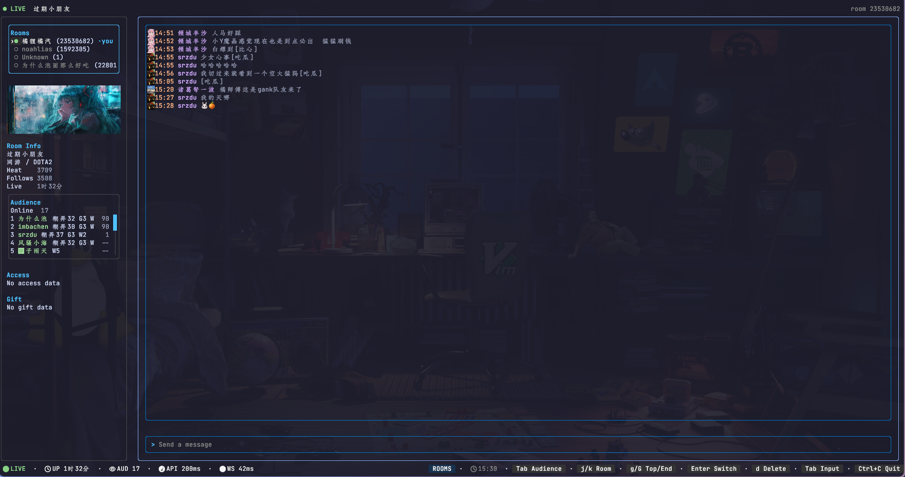

# bili-live-tui



`bili-live-tui` is a terminal UI for watching and sending Bilibili live-room chat. It shows live danmu, room status, audience and gift activity, recent rooms, themes, and basic latency indicators.

## Install

Download a release archive for your platform from:

```text
https://github.com/noahlias/bili-live-tui/releases
```

Or install with Go:

```sh
go install github.com/noahlias/bili-live-tui/cmd/bili-live-tui@latest
```

## Run

```sh
bili-live-tui
bili-live-tui -r 23530682 -t 1
bili-live-tui -c ./config.toml -r 23530682 -t 3
```

On first run, the app creates a config file at:

```text
~/.config/bili/config.toml
```

The config needs a valid Bilibili cookie to send messages and access authenticated live-room data. If the cookie is missing, the app can prompt for one and may try to import it from the local Chrome profile.

## Flags

```text
-c string   config file path
-r int      live room id
-t int      theme id
-l int      single-line message mode
-s int      show message time
```

## Themes

```text
1  Tokyo Night
2  Catppuccin Mocha
3  Gruvbox Dark
4  VSCode Dark
5  Catppuccin Latte
6  VSCode Light
```

Press `ctrl+t` inside the TUI to cycle themes at runtime.

## Keybindings

```text
tab        cycle focus between rooms, audience, messages, and input
esc        return focus to input, or quit selection mode
ctrl+c     quit
q          quit outside input mode
enter      send input, confirm room switch, or run command
ctrl+u     clear input or page audience/messages up by focus
up/down    previous or next input history, room selection, or message scroll by focus
j/k        move room selection, scroll audience, or scroll messages by focus
g/G        jump to top or bottom in audience/messages focus
v          enter message selection mode
y          copy selected message text in selection mode
e          open selected message in editor in selection mode
:room ID   switch to another room by command
```

## Development

```sh
go test ./...
goreleaser check
goreleaser build --snapshot --clean
```

`just build` runs the local snapshot build command.

## Attribution

This project is derived from `https://github.com/yaocccc/bilibili_live_tui.git` and is maintained independently.

## License

MIT
